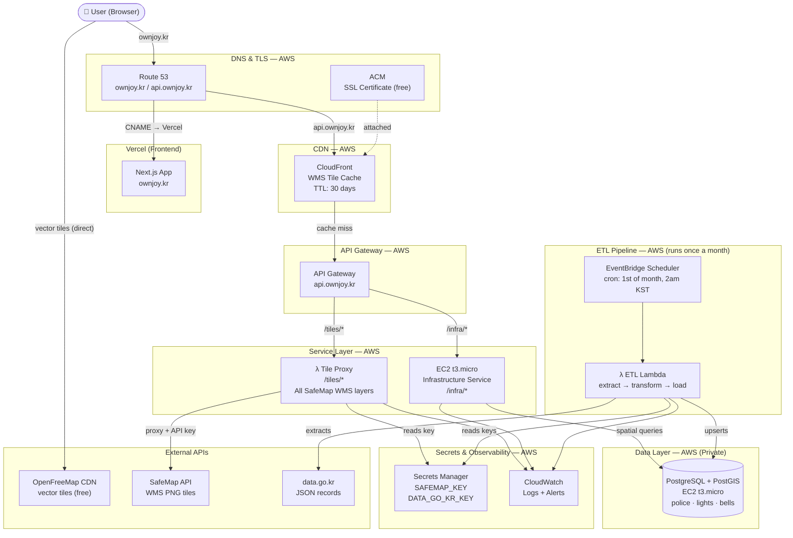

# ownjoy — Cloud Architecture Design

## Data Sources (confirmed)

| Source | What it returns | How consumed |
|---|---|---|
| **OpenFreeMap** | Vector tiles (static files, CDN) | Browser fetches directly — no backend needed |
| **SafeMap (safemap.go.kr)** | PNG image tiles only via WMS — JSON endpoint deprecated | Tile Proxy Lambda adds API key, proxies all layers |
| **data.go.kr** | JSON records — street lights, police stations, infrastructure | ETL extracts monthly → PostgreSQL → Infrastructure Service |

---

## Architecture Diagram



---

## Service Breakdown

### λ Tile Proxy Service
- **What:** Receives WMS tile requests from the browser, appends `serviceKey` from Secrets Manager, forwards to SafeMap, returns PNG
- **Why Lambda:** Stateless pass-through — no DB, no logic. Scales to zero. Free.
- **Caching:** CloudFront caches each PNG tile for 30 days. Government data doesn't change daily — after warm-up, ~90% of requests are served from cache without touching Lambda
- **Handles all SafeMap layers:** crime heatmaps, safety zones, emergency bells, CPTED zones — all identical from the proxy's perspective, just different layer names in the URL

### Infrastructure Service (EC2)
- **What:** Serves GeoJSON from PostgreSQL for police stations, street lights, emergency bells
- **Why EC2 (not Lambda):** Maintains a persistent DB connection pool. Lambda would open a new connection per invocation and overwhelm a small PostgreSQL instance.
- **Endpoints:**
  - `GET /infra/police?bbox=126.8,37.4,127.1,37.7` → GeoJSON FeatureCollection
  - `GET /infra/lights?bbox=...` → GeoJSON
  - `GET /infra/bells?bbox=...` → GeoJSON

### λ ETL Lambda
- **What:** Calls data.go.kr once a month, transforms records, upserts into PostgreSQL
- **Why Lambda:** Runs for a few minutes once a month. Paying for an always-on server for this would be wasteful.
- **On failure:** CloudWatch alarm sends email alert

---

## Data Flow

### User views the map (real-time)
```
1. Browser loads https://ownjoy.kr
2. CloudFront → S3 → serves HTML/JS/CSS
3. MapLibre fetches vector base tiles directly from OpenFreeMap CDN
4. User toggles a WMS layer (e.g. crime heatmap)
5. Browser → /tiles/IF_0079_WMS?bbox=...
6. CloudFront checks cache → hit: return PNG immediately
                           → miss: Lambda adds API key → SafeMap → PNG → cached 30 days
7. Browser → /infra/police?bbox=... → EC2 → PostGIS query → GeoJSON markers on map
```

### Monthly ETL (automated, no user involved)
```
1. EventBridge fires 1st of month at 2am KST
2. Lambda reads API keys from Secrets Manager
3. Lambda calls data.go.kr → fetches street lights, police stations
4. Transforms records, validates coordinates
5. Upserts into PostgreSQL (preserves history, no full wipe)
6. Logs row counts to CloudWatch
```

---

## Database Schema

```sql
-- infrastructure schema

CREATE TABLE infrastructure.police_stations (
    id           SERIAL PRIMARY KEY,
    name         TEXT NOT NULL,
    address      TEXT,
    location     GEOMETRY(Point, 4326),
    source_id    TEXT UNIQUE,
    refreshed_at TIMESTAMPTZ
);

CREATE TABLE infrastructure.street_lights (
    id           SERIAL PRIMARY KEY,
    address      TEXT,
    has_cctv     BOOLEAN,
    has_wifi     BOOLEAN,
    has_emergency_call BOOLEAN,
    location     GEOMETRY(Point, 4326),
    source_id    TEXT UNIQUE,
    refreshed_at TIMESTAMPTZ
);

CREATE TABLE infrastructure.emergency_bells (
    id           SERIAL PRIMARY KEY,
    address      TEXT,
    location     GEOMETRY(Point, 4326),
    source_id    TEXT UNIQUE,
    refreshed_at TIMESTAMPTZ
);

-- Spatial indexes
CREATE INDEX ON infrastructure.police_stations    USING GIST (location);
CREATE INDEX ON infrastructure.street_lights      USING GIST (location);
CREATE INDEX ON infrastructure.emergency_bells    USING GIST (location);

-- Viewport query example
SELECT name, ST_AsGeoJSON(location) AS geojson
FROM infrastructure.police_stations
WHERE ST_Within(location, ST_MakeEnvelope(126.8, 37.4, 127.1, 37.7, 4326));
```

---

## AWS Services & Cost

| Service | Role | Cost after credits |
|---|---|---|
| **Vercel** | Next.js frontend hosting | Free |
| **Route 53** | DNS for ownjoy.kr | ~$0.50/month |
| **ACM** | SSL certificate, auto-renews | Free |
| **CloudFront** | WMS tile cache (in front of API Gateway) | Free (1TB always) |
| **API Gateway** | Routes /tiles and /infra | ~$1/million requests |
| **Lambda — Tile Proxy** | Proxies SafeMap WMS, hides API key | Free (1M req always) |
| **Lambda — ETL** | Monthly data extraction | Free (1M req always) |
| **EventBridge** | Monthly cron trigger | Free |
| **EC2 t3.micro** | Infrastructure Service + PostgreSQL | ~$8/month |
| **Secrets Manager** | SAFEMAP_KEY + DATA_GO_KR_KEY | ~$0.80/month |
| **CloudWatch** | Logs + alerts | Free tier |

**Estimated total after $200 credits run out: ~$9-10/month**
